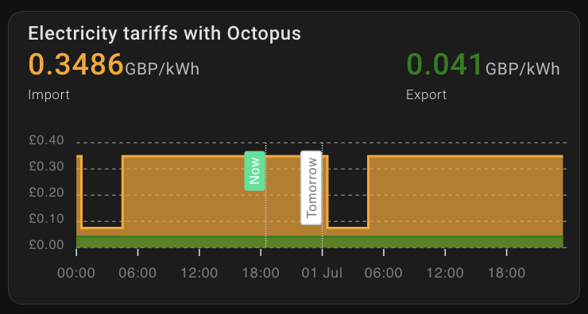

# Community Contributions

These are a few contributions by the community.

## Agile Price Table

If you're wanting to display upcoming prices in a nice readable format, then you can utilise the [Octopus Energy Rates card](https://github.com/lozzd/octopus-energy-rates-card) developed by [@lozzd](https://github.com/lozzd).


## Greenness Forecast

If you're wanting to display [greenness forecast](./entities/greenness_forecast.md) in a nice readable format, then you can utilise the [Octopus Energy Greenness Forecast Card](https://github.com/elyobelyob/octopus-energy-greenness-forecast-card) developed by [@elyobelyob](https://github.com/elyobelyob).


## Home battery prediction and charging

If you use OE with a home battery, you might be interested in [predbat](https://github.com/springfall2008/batpred), which can take advantage of the data available through this integration.

## Import and Export Rates Charts

Thanks to @fboundy you can use [ApexCharts Card](https://github.com/RomRider/apexcharts-card) to plot the import and export rates for the current day using the following configuration. 
Remember that the import and export current_day_rates and next_day_rates will be [disabled by default](./faq.md#there-are-entities-that-are-disabled-why-are-they-disabled-and-how-do-i-enable-them) and you will have to enable them and wait for the next update of Octopus agile rates at 4pm before you can add this card to your dashboard.
Replace `{{METER_SERIAL_NUMBER}}_{{MPAN_NUMBER}}{{_export}` with your information and whether you want the import or export rate chart:

```yaml
type: custom:apexcharts-card
header:
  show: true
  show_states: true
  colorize_states: true
  title: Agile {{Export}} Rates
graph_span: 1d
stacked: false
span:
  start: day
apex_config:
  legend:
    show: false
yaxis:
  - min: ~0
    max: ~35
    decimals: 1
series:
  - entity: >-
      event.octopus_energy_electricity_{{METER_SERIAL_NUMBER}}_{{MPAN_NUMBER}}{{_export}}_current_day_rates
    type: column
    name: ''
    color: yellow
    opacity: 1
    stroke_width: 0
    unit: p
    show:
      in_header: false
      legend_value: false
    data_generator: |
      return entity.attributes.rates.map((entry) => {
      return [new Date(entry.start), entry.value_inc_vat * 100];
      });
    offset: '-15min'
  - entity: >-
      event.octopus_energy_electricity_{{METER_SERIAL_NUMBER}}_{{MPAN_NUMBER}}{{_export}}_next_day_rates
    type: column
    name: ''
    color: yellow
    opacity: 1
    stroke_width: 0
    unit: p
    show:
      in_header: false
      legend_value: false
    data_generator: |
      return entity.attributes.rates.map((entry) => {
      return [new Date(entry.start), entry.value_inc_vat * 100];
      });
    offset: '-15min'
```

which will produce something like the following...


If you're looking for cost vs power using [ApexCharts Card](https://github.com/RomRider/apexcharts-card), then @plandregan has you covered with the following configuration. Replace `{{METER_SERIAL_NUMBER}}_{{MPAN_NUMBER}}` and `sensor.givtcp_xxxxxxxxxxxx_grid_power` with your information:

```yaml
type: custom:apexcharts-card
experimental:
  color_threshold: true
header:
  show: true
  floating: true
  title: Cost vs Power
graph_span: 24h
show:
  last_updated: true
  loading: true
apex_config:
  legend:
    show: false
  chart:
    zoom:
      type: x
      enabled: true
      autoScaleYaxis: false
    toolbar:
      show: true
      autoSelected: zoom
    xaxis.type: datetime
  fill:
    type: gradient
    gradient:
      shadeIntensity: 0.1
      opacityFrom: 0.3
      opacityTo: 1
      inverseColors: true
series:
  - entity: sensor.octopus_energy_electricity_{{METER_SERIAL_NUMBER}}_{{MPAN_NUMBER}}_current_rate
    transform: return x * 100;
    type: area
    name: GBP/kWh
    yaxis_id: pence
    color: lightblue
    group_by:
      func: avg
      duration: 5m
    stroke_width: 2
    extend_to: now
    show:
      extremas: false
      header_color_threshold: true
  - entity: sensor.givtcp_xxxxxxxxxxxx_grid_power
    transform: return x /1000;
    type: line
    invert: true
    name: Power
    yaxis_id: kwh
    group_by:
      func: avg
      duration: 5m
    color: red
    stroke_width: 2
    extend_to: now
yaxis:
  - id: pence
    min: ~0
    max: ~35
    opposite: false
  - id: kwh
    min: ~0
    max: ~10
    opposite: true
```

which will produce something like the following...


## Import and Export Rates Chart

If you're looking to combine import and export rates then create a card with the configuration. Replace `{{METER_SERIAL_NUMBER}}_{{MPAN_NUMBER}}` with your information:


```yaml
type: custom:config-template-card
entities:
  - event.octopus_energy_electricity_{{METER_SERIAL_NUMBER}}_{{MPAN_NUMBER}}_current_day_rates
  - event.octopus_energy_electricity_{{METER_SERIAL_NUMBER}}_{{MPAN_NUMBER}}_next_day_rates
  - event.octopus_energy_electricity_{{METER_SERIAL_NUMBER}}_{{MPAN_NUMBER}}_export_current_day_rates
  - event.octopus_energy_electricity_{{METER_SERIAL_NUMBER}}_{{MPAN_NUMBER}}_export_next_day_rates
card:
  card_mod:
    style: |
      ha-card {
        --secondary-text-color: rgb(225,225,225)
      }
  type: custom:apexcharts-card
  show:
    loading: false
  color_list:
    - orange
    - green  
  header:
    title: Electricity tariffs with Octopus
    show: true
    show_states: true
    colorize_states: true
  span:
    start: day
  graph_span: 48h
  update_interval: 30mins
  all_series_config:
    type: area
    float_precision: 4
    extend_to: now
    stroke_width: 2
    fill_raw: 'null'
  series:
    - entity: event.octopus_energy_electricity_{{METER_SERIAL_NUMBER}}_{{MPAN_NUMBER}}_current_day_rates
      name: Import today
      curve: stepline
      data_generator: |
        return entity.attributes.rates.map((entry) => {
          return [new Date(entry.start), entry.value_inc_vat];
        });
    - entity: event.octopus_energy_electricity_{{METER_SERIAL_NUMBER}}_{{MPAN_NUMBER}}_next_day_rates
      name: Import tomorrow
      curve: stepline
      data_generator: |
        return entity.attributes.rates.map((entry) => {
          return [new Date(entry.start), entry.value_inc_vat];
        });
    - entity: >-
        event.octopus_energy_electricity_{{METER_SERIAL_NUMBER}}_{{MPAN_NUMBER}}_export_current_day_rates
      name: Export
      curve: stepline
      data_generator: |
        return entity.attributes.rates.map((entry) => {
          return [new Date(entry.start), entry.value_inc_vat];
        });
    - entity: >-
        event.octopus_energy_electricity_{{METER_SERIAL_NUMBER}}_{{MPAN_NUMBER}}_export_next_day_rates
      name: Export
      curve: stepline
      data_generator: |
        return entity.attributes.rates.map((entry) => {
          return [new Date(entry.start), entry.value_inc_vat];
        });
  apex_config:
    tooltip:
      x:
        format: ddd dd MMM - HH:mm
    xaxis:
      axisBorder:
        show: false
      tooltip:
        enabled: false
    grid:
      borderColor: '#7B7B7B'
    legend:
      show: false
      toolbar:
        show: true
        autoSelected: zoom
        tools:
          zoom: true
          zoomin: false
          zoomout: false
          pan: false
          reset: true
    annotations:
      xaxis:
        - x: ${ new Date().setHours(24,0,0,0) }
          label:
            text: Tomorrow
        - x: ${Date.now()}
          label:
            text: Now
            borderColor: '#00E396'
            style:
              color: '#fff'
              background: '#00E396'
            borderWidth: 0
    yaxis:
      min: ~0
      max: ~0.4
      tickAmount: 4
      labels:
        formatter: |
          EVAL:function (val) {
           return "£" + val.toFixed(2);
          }
      forceNiceScale: true
    chart:
      height: 150
      foreColor: '#7B7B7B'
      zoom:
        type: x
        enabled: true
        autoScaleYaxis: true
```

to generate the following card...


