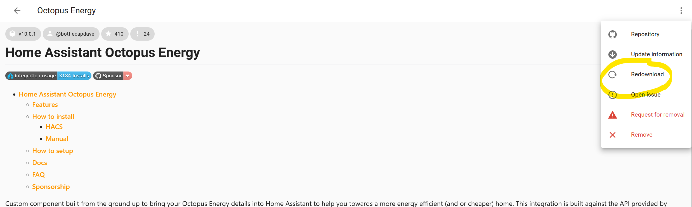
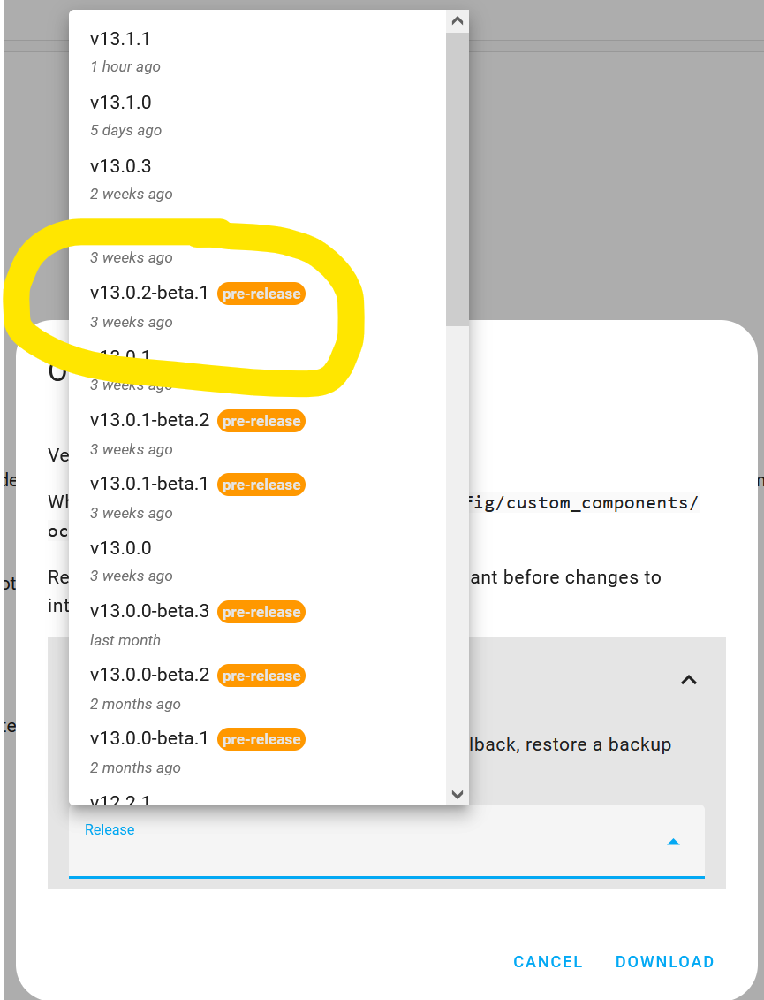
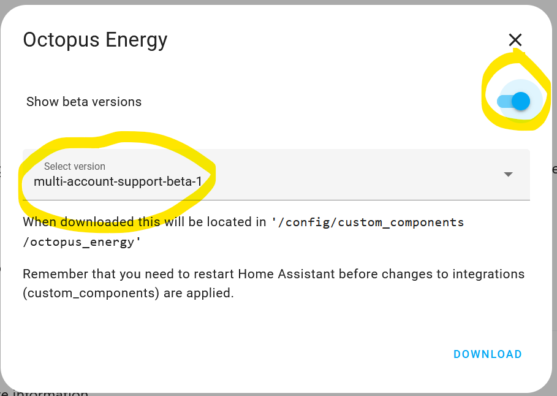

# FAQ

## How often is data refreshed?

Based on a request from [Octopus Energy](https://forum.octopus.energy/t/pending-and-completed-octopus-intelligent-dispatches/8510/8?u=bottlecapdave), the integration polls and retrieves data at different intervals depending on the target data. Below is a rough table describing how often the integration targets refreshing various bits of data. This has been done to try and not overload the API while also providing useful data in a timely fashion - Octopus Energy estimate that ~95% of their traffic comes mainly from this integration.

| Area | Refresh rate (in minutes) | Justification |
|-|-|-|
| Account | 60 | This is mainly used to get the active meters and associated tariffs, which shouldn't change often so no need to poll often. |
| Intelligent tariff based sensors | 3 | Trying to balance refreshing settings and new dispatch information without overloading the API |
| Rate information | 15 | This is what drives most people's automations, but doesn't change that frequently. We can afford a bit of lag for API stability. This will stop updating once we have the data for the requested time period. |
| Current consumption data | Configurable (minimum 1) | This is most useful for a smart home to be as up-to-date as possible, but is also rate limited to 100 requests total per hour. 1 minute is enough for most people, but might need to be increased for those with multiple meters (e.g. gas and electricity) |
| Previous consumption data | 30 | This is usually refreshed once a day at various times throughout the day. We want to be up-to-date as soon as possible, without swamping the API. |
| Standing charges | 60 | This should only change if the user's tariff changes, so no need to request data too often. Keep in sync with account refreshes. This will stop updating once we have the data for the requested time period. |
| Saving sessions | 15 | Inactive for most of the year and new sessions have enough warning to allow a bit of lag. |
| Saving session target | 30 | Not relevant most of the time and intensive due to retrieving consumption data |
| Wheel of fortune | 60 | Doesn't change that frequently, and not fundamental for a smart home (other than knowledge) so no need to request too often. |
| Greenness Forecast | 180 | Doesn't change frequently |
| Free electricity sessions | 90 | Data is provided by my own [private API](https://github.com/BottlecapDave/OctopusEnergyApi) and there is usually at least half a day notice before the sessions which is why this is refreshed slightly less than saving sessions. |
| Heat Pump state | 1 | Data is updated frequently and doesn't seem to cause any issues around rate limits. This might change in the future. |

If data cannot be refreshed for any reason (e.g. no internet or APIs are down), then the integration will attempt to retrieve data as soon as possible, slowly waiting longer between each attempt, to a maximum of 30 minutes between each attempt. Below is a rough example assuming the first (failed) scheduled refresh was at `10:35`.

| Attempt | Target time |
|-|-|
| 1 | `10:35` |
| 2 | `10:36` |
| 3 | `10:38` |
| 4 | `10:41` |
| 5 | `10:45` |

Once a successful request is made, the refreshes will revert back to the redefined default intervals. You can find out information on when data was last retrieved via the available [diagnostic entities](./entities/diagnostics.md).

!!! note
    The retrieving of data does not effect the rate the entities states/attributes are evaluated.

## The integration provides features I don't need, can I turn the feature off?

There is no config option to turn features on/off. This is because the required data is not cut and dry per feature as some data is shared among "features" (e.g. rate data is required to determine if consumption data is peak or off peak).

However, the integration only requests the data specified above that is needed for the provided entities to function. If you disable the entities that you don't need, then the integration won't request the corresponding data. 

Disabling entities is easy. All you need to do is

1. Go to the [Octopus Energy](https://my.home-assistant.io/redirect/integration/?domain=octopus_energy) integration.
2. Click on `entities`
3. Go into multi-select mode and select the entities you want to disable
4. Select `Disable selected`

Some entities are disabled by default by the integration, which are highlighted as such in the documentation.

## I have data missing, is this an issue with the integration?

Data can not appear for a variety of reasons. Before raising any issues, check if the data is available on the [website](https://octopus.energy/dashboard/new/accounts/consumption/home) for the requested period (e.g. for previous consumption, you'll be wanting data for the day before). If it's not available on the website, then unfortunately there is nothing that can be done and you may need to contact Octopus Energy.

Data might also not appear if you lose internet connection or the Octopus Energy APIs report errors, which can occur from time to time. This will be indicated in your Home Assistant logs as warnings around using cached data. It can also be diagnosed via the various available [diagnostic entities](./entities/diagnostics.md). If none of this is applicable, then please raise an issue so we can try and solve the problem.

If you are missing consumption data, the previous consumption sensors only display that latest available full day. If you have a couple of hours for a day, then the sensors will not display this until the full day is available.

## Data in my Home Assistant energy dashboard reported by Octopus Home Mini differs to Octopus Energy dashboard. Why is this?

The data can differ for a number of reasons.

If you are looking at the current day, then Home Assistant only updates the energy dashboard data once an hour, near the hour. This means you might be "missing" data in the energy dashboard when compared to the app. The integration also makes best effort to retrieve the data every minute, however it has been noticed that the API can fail at times to retrieve the data.

If you are comparing data in the energy dashboard to previous days data in the Octopus Energy dashboard, then this can also differ. This is because Octopus Energy favour data reported by your smart meter, as this is what your bills use, over your Home Mini.

## I've added my previous consumption sensors to the Energy dashboard, but they are reported in a single chunk and are a day or more out. Is this a bug?

While you can add the `previous consumption` sensors to the dashboard, they will be associated with the wrong day. This is because the Energy dashboard uses the timestamp of when the sensor updates to determine which day the data should belong to.

Instead, you can use different external statistics that are exported by the `previous consumption` sensors, which are broken down into hourly chunks. 

!!! info 

    It can take **up to 24 hours** for the external statistics to appear.

Please follow the [guide](./setup/energy_dashboard.md#previous-day-consumption) for instructions on how to add these separate sensors to the energy dashboard.

You should not have this issue for current consumption sensors, as they are updated in realtime.

## Why are the names of the entities so long, and can you change them to be shorter?

Naming things are hard. The entity ids are long for the following reasons

* The domain is present as I didn't want to potentially clash with other integrations that provide similar sensors for meters, as a lot of people in the community use things like the glow device to get their readings. Hindsight, I probably wouldn't include this, but we're here now.

* The serial number and mpan/mprn is present because the data that comes back from OE is in an array of arrays. I am only on an import tariff, so couldn't guarantee that any of these were unique and didn't want to assume anything. Turns out one of these is duplicated between import/export meters so if I had picked one of these I would have been wrong and had a clash.

* The account id is present in other sensors in order to support multiple accounts (which the serial number/mpan/mprn also play apart in).

The names of the entities are equally long for consistency with the entity id and so that you can tell one entity apart from another in the above scenarios.

However you are free to update the names and/or ids to something more concise for you as per the [Home Assistant docs](https://www.home-assistant.io/docs/configuration/customizing-devices/#changing-the-entity-id).

## I am getting warnings about entities taking too long to update. Is this normal?

If you receiving warnings along the lines of

> Update of sensor.octopus_energy_xxx is taking over x seconds

> Updating octopus_energy sensor took longer than the scheduled update interval

then yes, this is expected. This is a default warning built into Home Assistant, however with this integration it's perfectly valid for you to receive this when the sensors attempt to update the data. This is for a number of reasons

1. Your internet connection is slow
2. Octopus Energy APIs are slow to respond, or having issues.

If you wish to suppress this warning, you can follow [this advice](https://github.com/BottlecapDave/HomeAssistant-OctopusEnergy/issues/429#issuecomment-1783739547).

## I am getting errors relating to "Too many requests". Is there something wrong?

The most common scenario for this is related to the Home Mini. This can be determined by the presence of `smartMeterTelemetry` in the error message. The Octopus Energy APIs have a rate limit of 100 calls per hour, which is shared among all calls including through the app or other integrations. The defaults are usually enough for one electricity and one gas meter's data to be retrieved. However, if you are using other integrations, have more meters being tracked or want the app to not be effected you may want to increase this rate via your [account](./setup/account.md#refresh-rate-in-minutes).

If you are receiving this error for a different reason, please raise an [issue](https://github.com/BottlecapDave/HomeAssistant-OctopusEnergy/issues), as Octopus Energy might have introduced a new rate limit.

## I want to use a utility meter with the consumption sensors, but they don't seem to be adding up correctly. Is there something I'm doing wrong?

While the underlying data updates less frequently (see above), the consumption sensors themselves update every minute to check for changes. This includes attribute updates to state when the sensor was last evaluated or when the underlying data was last retrieved. Unfortunately the utility meter looks for _any_ updates to the input sensor, which includes attribute changes. Therefore if you wish to use a utility meter, you'll need to create a template sensor that wraps the consumption sensor you're wishing to target and just exposes the state, and use this template sensor as your input. This will ignore any attribute updates and stabilise the utility meter updates.

## There are entities that are disabled. Why are they disabled and how do I enable them?

Some entities are disabled by default. This is usually because the entities are not applicable for all tariffs or are for niche scenarios. By having these entities disabled, it also doesn't overwhelm new users when they install the integration otherwise most users will be presented with over 40 different entities.

Enabling entities is easy. All you need to do is

1. Go to the [Octopus Energy](https://my.home-assistant.io/redirect/integration/?domain=octopus_energy) integration.
2. Click on `entities`
3. Find and click on the entity you want to enable. This is usually indicated by a "no entry" sign in the `status`.
4. Click on the settings/cog button
5. Click on the `enable` button or toggle the `Enabled` toggle to on
6. Click on `update`

## I have entities that are missing. Is the integration broken?

The integration only looks at the first property associated with your account that doesn't have a moved out date attached to it. If you are still missing entities, follow the instructions to [increase the logs](#how-do-i-increase-the-logs-for-the-integration).

You should then see entries associated with this component stating either entities were added, skipped or no entities were available at all.

The identifiers of the entities should then be checked against your Octopus Energy dashboard to verify the correct entities are being picked up. If this is producing unexpected results, then you should raise an issue.

## I have meters that are missing. Is the integration broken?

The integration will only surface entities associated with meters in your first active property. Each meter must also have an active tariff associated with it. 

If you [follow the instructions](#ive-been-asked-for-my-meter-information-in-a-bug-request-how-do-i-obtain-this) to download diagnostics, you can see all agreements associated with each of your meters. You will need an agreement with a start date in the past and an end date either set to `null` or in the future for the meter to be picked up by the integration.

## I'm an agile user and having trouble setting up a target rate sensor. What am I doing wrong?

Rate data for agile tariffs are not available in full for the next day, which can cause issues with target rate sensors in their default state. We prevent you from setting up target rate sensors in this form. More information around this can be found in the [target rate documentation](./setup/target_rate.md#agile-users).

## Why won't my target rates update?

The target rate sensors are set to update every minute, which includes determining if you're within a target time period and calculating future target time periods. This can be confirmed by evaluating the [last_updated](https://community.home-assistant.io/t/how-to-display-the-last-updated-field-of-an-entity-in-the-lovelace-view/728892/2?u=bottlecapdave) attribute of the sensor. 

The `target_times` will evaluate once all rates are available for the specified time period and all existing target times are in the past. When this was last evaluated can be confirmed via the `target_times_last_evaluated` attribute. For example, if you are looking for target rates between 16:00 (today) and 16:00 (tomorrow), and you only have rates up to 23:00 (today), then target times will not be evaluated until rate information is available up to 16:00 (tomorrow). This can be confirmed by reviewing the data available in your current and next day rates entities.

If there is a delay in retrieving rate information, there is chance that when it comes to evaluation, times are picked that are in the past because they were the lowest. This will result in your target rate sensor skipping a day and waiting to calculate new target times for the next scheduled time period. This can be confirmed by comparing the `target_times` and the `target_times_last_evaluated` attribute. If this happens frequently, then please adjust the target time periods of your target rate sensor to something that works for you.

If the `last_updated` attribute is not updating, then please raise an issue.

## My gas consumption/costs seem out

Depending on the native reading from your meter or the sensor you're looking at, the consumption may have to be converted from kWh into cubic meters.

* The current consumption (m3) is always calculated, as the Home Mini provides this data in kWh via the API.
* The previous consumption sensor (m3) _may_ be calculated if your meter natively speaks in kWh. This is indicated by the `is_estimated` attribute on the sensor

Because all rates are in kWh, if any conversions are required into kWh then the cost could also be out by this conversion.

The conversion cubic meters (m3) to kWh is achieved by following this [formula](https://www.theenergyshop.com/guides/how-to-convert-gas-units-to-kwh). The part that can differ from person to person is the calorific value, which defaults in the integration to 40. This will most likely be incorrect, but unfortunately is not provided by the OE APIs. Therefore you'll need to set it as part of your [account](./setup/account.md#calorific-value). This changes throughout the year and can be found on your latest bill.

## The rates are different to what's on my bill or the Octopus Energy dashboard. Is there something wrong?

The first thing to do is make sure the correct tariff has been picked up. This can be done by confirming the tariff code on the [electricity](./entities/electricity.md#current-rate) or [gas](./entities/gas.md#current-rate) current rate sensors. This is picked up automatically via the API, so if this is wrong, then it means that either your account doesn't have your tariff configured yet or the wrong one is being picked up. This can be confirmed via your [meter information](#ive-been-asked-for-my-meter-information-in-a-bug-request-how-do-i-obtain-this).

If the correct tariff is present, it might be that you're on a tariff that has different rates depending on if you pay by direct debit or not. This can be configured via your [account configuration](./setup/account.md#favour-direct-debit-rates).

## Do you support older versions of the integration?

Due to time constraints, I will only ever support the latest version of the integration. If you have an issue with an older version of the integration, my initial answer will always be to update to the latest version. This might be different to what HACS is reporting if you are not on the minimum supported Home Assistant version (which is highlighted in each release's changelog). 

## How do I know when there's an update available?

If you've installed via HACS, and you are on version 2 or above, then updates will be surfaced in the normal update location within Home Assistant. If you are on a version below 2, then you can keep an eye on `sensor.hacs` to see the number of pending updates. This could be used with an automation or highlighted on your dashboard. This will include any HACS integration update, not just this one.

If you've installed the integration manually, then you should keep an eye on the [GitHub releases](https://github.com/BottlecapDave/HomeAssistant-OctopusEnergy/releases). You could even subscribe to the [RSS feed](https://github.com/BottlecapDave/HomeAssistant-OctopusEnergy/releases.atom).

## There's a beta release of the integration that I would like to take part in, how do I do this?

If you install the integration manually, it's just a case of getting the source of the [beta release](https://github.com/BottlecapDave/HomeAssistant-OctopusEnergy/releases), replacing the old installation with the new one and restarting Home Assistant.

If you install the integration via HACS, then you will need to

* Go to [HACS](https://my.home-assistant.io/redirect/hacs_repository/?owner=BottlecapDave&repository=homeassistant-octopusenergy&category=integration), click on the three dots and then click redownload



* If you are on version 2 or above, then click on `Need a different version?` and select the `Release` box and then select your target `pre-release` version



If you are on a version below 2, then toggle on `Show beta versions` and select the target beta. Once selected, click `Download`.



* Once downloaded, you'll need to restart Home Assistant for the new version to take effect.

## How do I increase the logs for the integration?

If you are having issues, it would be helpful to include Home Assistant logs as part of any raised issue. This can be done by following the [instructions](https://www.home-assistant.io/docs/configuration/troubleshooting/#enabling-debug-logging) outlined by Home Assistant.

You should run these logs for about a day and then include the contents in the issue. Please be sure to remove any personal identifiable information from the logs before including them.

## I've been asked for my meter information in a bug request, how do I obtain this?

If you've been asked for meter information, don't worry we won't ask for anything sensitive. To obtain this information

1. Navigate to [your devices](https://my.home-assistant.io/redirect/devices/)
2. Search for "Octopus Energy"
3. Click on one of the meters
4. Click on "Download diagnostics"
5. Take the contents of the downloads json file and paste into the bug report. Remember to surround the contents with ``` both at the start and end.
