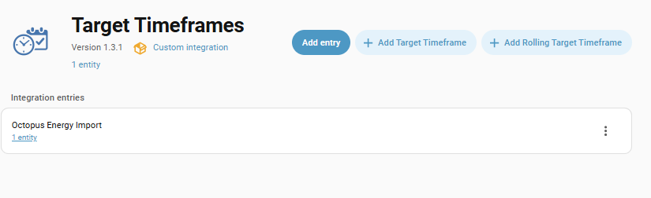

# Migrating Target Rate Sensors To Target Timeframes

It has been [proposed](https://github.com/BottlecapDave/HomeAssistant-OctopusEnergy/discussions/1305) that the target rate feature of the integration be deprecated and removed in favour of a new external integration, [Target Timeframes](https://bottlecapdave.github.io/HomeAssistant-TargetTimeframes/). The full reasoning can be found in the proposal.

This guide explains how to migrate your target rate sensors to the new integration.

## Installing the integration

The first thing you need to do is install the new integration. Full instructions can be found on [the website](https://bottlecapdave.github.io/HomeAssistant-TargetTimeframes/#how-to-install).

## Setting up data sources

Once installed, you'll need to setup a data source that represents data coming from this integration. This can be done by [following the link](https://my.home-assistant.io/redirect/config_flow_start/?domain=target_timeframes) or searching for the integration in your integrations view. You'll need a data source for each of your meters (e.g. one for import and one for export)

The recommended name is `Octopus Energy Import` and the recommended source id is `octopus_energy_import`, but you can pick whatever you want as long as it's unique within the integration.

## Configuring Octopus Energy data

Next, we'll need to get data from the Octopus Energy integration into the Target Timeframes integration. The recommended approach is an automation based on the [available blueprint](https://bottlecapdave.github.io/HomeAssistant-TargetTimeframes/blueprints/#octopus-energy). This will track when the rate entities within the Octopus Energy integration update. Upon updating, it will then transform the rate data into the shape required by Target Timeframes and use the available service to add the rate data with the data source we just created. Each `value` in Target Timeframes will represent our rate in pounds/pence.

## Setting up Target Rate sensors

Now we have our data source representing Octopus Energy and data coming from this integration into Target Timeframes, it's time to now port across our target rate and rolling target rate sensors. Each type of sensor are added as a sub entry to our data source. You can see below what the menu looks like.

For porting a [target rate sensor](../setup/target_rate.md), you would select [target timeframe](https://bottlecapdave.github.io/HomeAssistant-TargetTimeframes/setup/target_timeframe/) and for porting a [rolling target rate sensor](../setup/rolling_target_rate.md), you would select [rolling target timeframe](https://bottlecapdave.github.io/HomeAssistant-TargetTimeframes/setup/rolling_target_timeframe/).

All options within the sensors should feel familiar, as they represent what's available within this integration. Below are some noticeable differences

* `Invert targeted rates` in the Octopus Energy integration is represented by `Find highest values`. If `Invert targeted rates` is checked, for sensors using data sources targeting import meters, `Find highest values` should be checked. If `Invert targeted rates` is checked, for sensors using data sources targeting export meters, `Find highest values` should be checked.

!!! info

    If you are wanting to minimise updates of automations, once the target timeframe sensor has been created and you delete the old sensor from the Octopus Energy integration, you can rename the entity id to have the name of the old sensor. For example, if you have a target sensor with the entity id of `sensor.target_timeframe_octopus_energy_import_dishwasher`, your could rename it to `sensor.octopus_energy_target_dishwasher`.

!!! warning

    There is currently a bug in HA where you'll need to reload the data source when a target rate sensor is added/updated in order to see the target rate sensor.

## Available services

The following list of related services and their counterparts.

| OE Service | Target Timeframes Service |
|-|-|
| [octopus_energy.update_target_config](../services.md#octopus_energyupdate_target_config) | [target_timeframes.update_target_timeframe_config](https://bottlecapdave.github.io/HomeAssistant-TargetTimeframes/services/#target_timeframesupdate_target_timeframe_config) |
| [octopus_energy.update_rolling_target_config](../services.md#octopus_energyupdate_rolling_target_config) | [target_timeframes.update_rolling_target_timeframe_config](https://bottlecapdave.github.io/HomeAssistant-TargetTimeframes/services/#target_timeframesupdate_rolling_target_timeframe_config) |
| [octopus_energy.register_rate_weightings](../services.md#octopus_energyregister_rate_weightings) | Data is now loaded as part of [target_timeframes.update_target_timeframe_data_source](https://bottlecapdave.github.io/HomeAssistant-TargetTimeframes/services/#target_timeframesupdate_target_timeframe_data_source). Therefore data can be manipulated before this service is called. A [blueprint](https://bottlecapdave.github.io/HomeAssistant-TargetTimeframes/blueprints/#octopus-energy-and-carbon-intensity) is available as an example. |