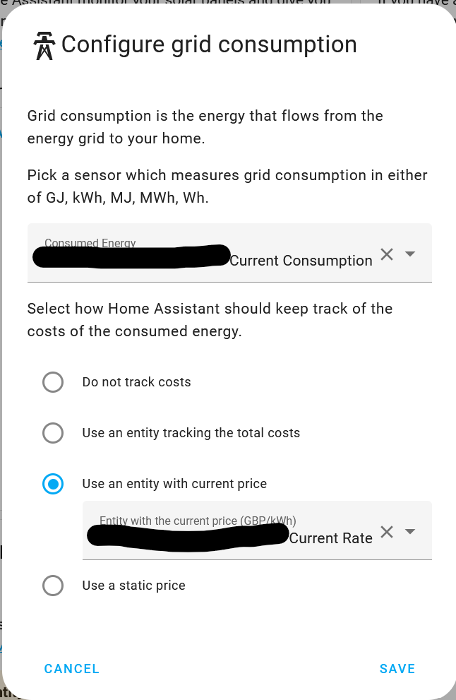
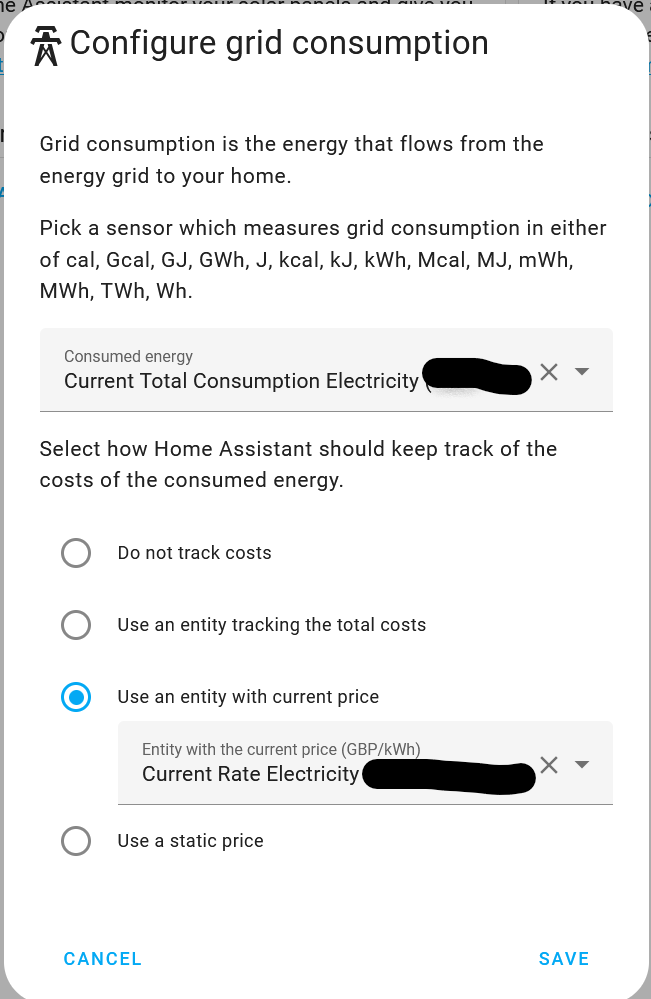
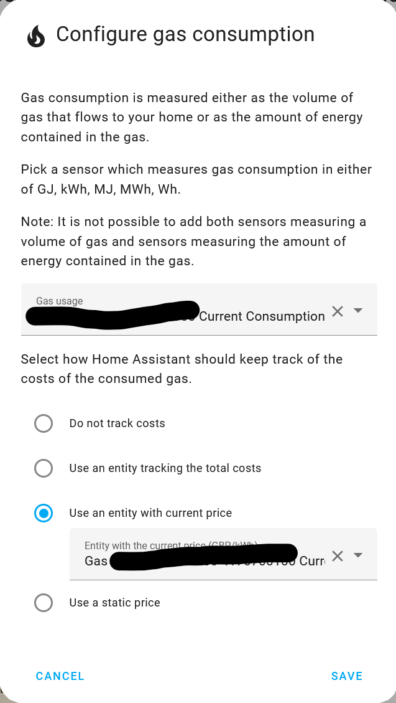
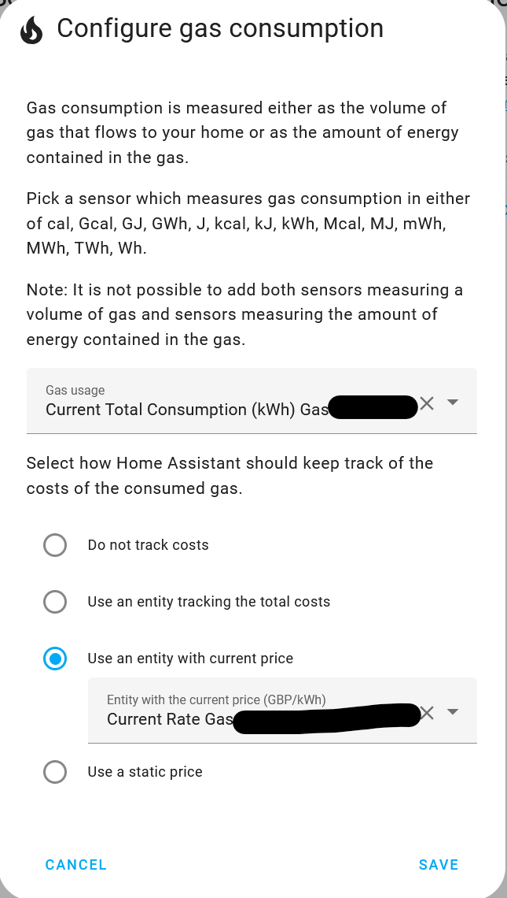
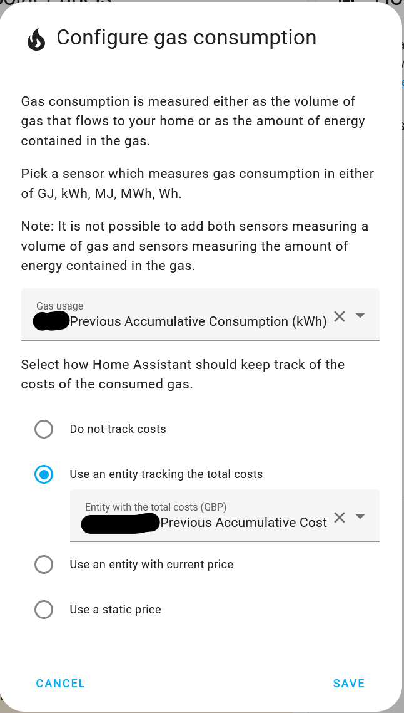

# Energy Dashboard

## Current Consumption

### For Electricity

You can only record current (i.e. today's) consumption in the Energy dashboard if you have a way of measuring live consumption in your home.

#### Octopus Home Mini

If you have an Octopus Home Mini and a smart electricity meter you can obtain live meter reading data into Home Assistant:

1. Go to your [energy dashboard configuration](https://my.home-assistant.io/redirect/config_energy/)
2. Click `Add Consumption` under `Electricity grid`
3. For `Consumed energy` you want `sensor.octopus_energy_electricity_{{METER_SERIAL_NUMBER}}_{{MPAN_NUMBER}}_current_accumulative_consumption`
4. Choose the `Use an entity tracking the total costs` option and the entity is `sensor.octopus_energy_electricity_{{METER_SERIAL_NUMBER}}_{{MPAN_NUMBER}}_current_accumulative_cost`

{: style="height:500px"}

!!! note
  
    Data will only appear in the energy dashboard from the point you configure the Home Mini within the integration. It doesn't backport any data.

#### Octopus Home Pro

If you have an Octopus Home Pro and a smart electricity meter you can obtain live meter reading data into Home Assistant:

1. Go to your [energy dashboard configuration](https://my.home-assistant.io/redirect/config_energy/)
2. Click `Add Consumption` under `Electricity grid`
3. For `Consumed energy` you want `sensor.octopus_energy_electricity_{{METER_SERIAL_NUMBER}}_{{MPAN_NUMBER}}_current_total_consumption`
4. Choose the `Use an entity with current price` option and the entity is `sensor.octopus_energy_electricity_{{METER_SERIAL_NUMBER}}_{{MPAN_NUMBER}}_current_rate`

{: style="height:500px"}

!!! note
  
    Data will only appear in the energy dashboard from the point you configure the Home Pro within the integration. It doesn't backport any data.

#### Alternative methods to measure current Home Consumption

If you don't have an Octopus Home mini you may have another way to get live or near-live daily consumption into Home Assistant such as a Hildebrand Glow In Home Display, an Energy CT Clamp such as the Shelly EM on the incoming supply cable, or your existing Solar/Battery inverter may have a sensor that provides Grid import information that you can use in the Energy dashboard.

Do be aware that as you are not directly capturing the smart meter readings in Home Assistant the consumption does not include the standing charge and there will always be a small measurement difference from what Octopus energy say you have used, but in practice the difference is likely to be quite small.

1. Create a utility meter that resets daily to store the consumption sensor information in, e.g. called `Grid Import Today`
2. The utility meter should point to the sensor that is measuring your grid import. e.g. for a Hildebrand Glow it could be `sensor.smart_meter_electricity_energy_import`; a Shelly EM will be `sensor.<EM channel name>_energy_total`; for a GivEnergy inverter using the GivTCP integration it will be `sensor.givtcp_XXyywwXnnn_import_energy_today_kwh`
3. Then add the consumption information to the Energy dashboard as per the steps for Octopus Home Mini above.  For step 3, `consumed energy`, you want the utility meter you have just created above, e.g. `sensor.grid_import_today` and for step 4, choose `Use an entity with current price` and the entity is `sensor.octopus_energy_electricity_{{METER_SERIAL_NUMBER}}_{{MPAN_NUMBER}}_current_rate`

### For Gas

#### Octopus Home Mini

If you have an Octopus Home Mini and a smart electricity meter you can obtain live meter reading data into Home Assistant:

1. Go to your [energy dashboard configuration](https://my.home-assistant.io/redirect/config_energy/)
2. Click `Add Gas Source` under `Gas consumption`
3. For `Gas usage` you want `sensor.octopus_energy_gas_{{METER_SERIAL_NUMBER}}_{{MPRN_NUMBER}}_current_accumulative_consumption_kwh`
4. For `Use an entity tracking the total costs` option you want `sensor.octopus_energy_gas_{{METER_SERIAL_NUMBER}}_{{MPRN_NUMBER}}_current_accumulative_cost` 

{: style="height:500px"}

!!! note

    Data will only appear in the energy dashboard from the point you configure the Home Mini within the integration. It doesn't backport any data.

#### Octopus Home Pro

If you have an Octopus Home Pro and a smart gas meter you can obtain live meter reading data into Home Assistant:

1. Go to your [energy dashboard configuration](https://my.home-assistant.io/redirect/config_energy/)
2. Click `Add Consumption` under `Electricity grid`
3. For `Consumed energy` you want `sensor.octopus_energy_gas_{{METER_SERIAL_NUMBER}}_{{MPRN_NUMBER}}_current_total_consumption_kwh`
4. Choose the `Use an entity with current price` option and the entity is `sensor.octopus_energy_gas_{{METER_SERIAL_NUMBER}}_{{MPRN_NUMBER}}_current_rate`

{: style="height:500px"}

!!! note
  
    Data will only appear in the energy dashboard from the point you configure the Home Pro within the integration. It doesn't backport any data.

## Previous Day Consumption

If none of the methods above for feeding Current Day Consumption information into the Energy dashboard are suitable, you can add `previous consumption` information to the dashboard, using information retrieved via the Octopus API. Note that the consumption information is only available on the following day so "today's" Energy dashboard will show zero values, but "yesterday's", "day before", etc will show the correct consumption for each day.

!!! warning

    **Beware**: Whilst you can add the previous consumption sensors directly to the Energy dashboard, they will be associated with the wrong day. This is because the Energy dashboard uses the timestamp of when the sensor updates to determine which day the data should belong to.

    Instead, you **must** use external statistics that are exported by the `previous consumption` sensors, which are broken down into hourly chunks. 

!!! info

    It can take **up to 24 hours** for the external statistics to appear.

!!! note

    I'm still investigating having hourly breakdowns imported on the entity themselves rather than as external statistics, but currently in doing so it's still including the spikes on the day of retrieval. I've opened a [forum post](https://community.home-assistant.io/t/help-needed-around-importing-historic-statistics/567726) but awaiting answers.

### For Electricity

{: style="height:500px"}

1. Go to your [energy dashboard configuration](https://my.home-assistant.io/redirect/config_energy/)
2. Click `Add Consumption` under `Electricity Grid`
3. For `consumed energy` you want one of the following:
 * **`octopus_energy:`**`electricity_{{METER_SERIAL_NUMBER}}_{{MPAN_NUMBER}}_previous_accumulative_consumption` - The total consumption reported by the meter for the previous day.  **Please note the different name to the standard entity, do NOT choose sensor.electricity_{{METER}}_{{MPAN}}_previous_accumulative_consumption.**
 * **`octopus_energy:`**`electricity_{{METER_SERIAL_NUMBER}}_{{MPAN_NUMBER}}_previous_accumulative_consumption_peak` - The total consumption reported by the meter during peak hours for the previous day. This will only be populated if you're on a tariff with two available rates and is [disabled by default](../faq.md#there-are-entities-that-are-disabled-why-are-they-disabled-and-how-do-i-enable-them). **Please note the different name to the standard entity, do NOT choose sensor.electricity_{{METER}}_{{MPAN}}_previous_accumulative_consumption_peak.**
 * **`octopus_energy:`**`electricity_{{METER_SERIAL_NUMBER}}_{{MPAN_NUMBER}}_previous_accumulative_consumption_off_peak` - The total consumption reported by the meter during off-peak hours for the previous day. This will only be populated if you're on a tariff with two available rates and is [disabled by default](../faq.md#there-are-entities-that-are-disabled-why-are-they-disabled-and-how-do-i-enable-them). **Please note the different name to the standard entity, do NOT choose sensor.electricity_{{METER}}_{{MPAN}}_previous_accumulative_consumption_off_peak.**
4. For `Use an entity tracking the total costs` option you want one of the following:
* `octopus_energy:electricity_{{METER_SERIAL_NUMBER}}_{{MPAN_NUMBER}}_previous_accumulative_cost` - The total cost for the previous day. **Please note the different name to the standard entity, do NOT choose sensor.octopus_energy_electricity_{{METER_SERIAL_NUMBER}}_{{MPAN_NUMBER}}_previous_accumulative_cost.**
* `octopus_energy:electricity_{{METER_SERIAL_NUMBER}}_{{MPAN_NUMBER}}_previous_accumulative_cost_peak` - The total cost for the previous day that applied during peak hours. This will only be populated if you're on a tariff with two available rates and is [disabled by default](../faq.md#there-are-entities-that-are-disabled-why-are-they-disabled-and-how-do-i-enable-them). **Please note the different name to the standard entity, do NOT choose sensor.octopus_energy_electricity_{{METER_SERIAL_NUMBER}}_{{MPAN_NUMBER}}_previous_accumulative_cost_peak.**
* `octopus_energy:electricity_{{METER_SERIAL_NUMBER}}_{{MPAN_NUMBER}}_previous_accumulative_cost_off_peak` - The total cost for the previous day that applied during off-peak hours. This will only be populated if you're on a tariff with two available rates and is [disabled by default](../faq.md#there-are-entities-that-are-disabled-why-are-they-disabled-and-how-do-i-enable-them). **Please note the different name to the standard entity, do NOT choose sensor.octopus_energy_electricity_{{METER_SERIAL_NUMBER}}_{{MPAN_NUMBER}}_previous_accumulative_cost_off_peak.**

### For Gas

{: style="height:500px"}

1. Go to your [energy dashboard configuration](https://my.home-assistant.io/redirect/config_energy/)
2. Click `Add Gas Source` under `Gas Consumption`
3. For `consumed energy` you want one of the following
* `octopus_energy:gas_{{METER_SERIAL_NUMBER}}_{{MPRN_NUMBER}}_previous_accumulative_consumption` - The total consumption reported by the meter for the previous day in m3. If your meter reports in m3, then this will be an accurate value reported by Octopus, otherwise it will be a calculated/estimated value. **Please note the different name to the standard entity, do NOT choose sensor.octopus_energy_gas_{{METER_SERIAL_NUMBER}}_{{MPRN_NUMBER}}_previous_accumulative_consumption.**
* `octopus_energy:gas_{{METER_SERIAL_NUMBER}}_{{MPRN_NUMBER}}_previous_accumulative_consumption_kwh` - The total consumption reported by the meter for the previous day in kwh. If your meter reports in kwh, then this will be an accurate value reported by Octopus, otherwise it will be a calculated/estimated value. **Please note the different name to the standard entity, do NOT choose sensor.octopus_energy_gas_{{METER_SERIAL_NUMBER}}_{{MPRN_NUMBER}}_previous_accumulative_consumption_kwh.**
1. For `Use an entity tracking the total costs` option you want the following
* `octopus_energy:gas_{{METER_SERIAL_NUMBER}}_{{MPRN_NUMBER}}_previous_accumulative_cost` - The total cost for the previous day. **Please note the different name to the standard entity, do NOT choose sensor.octopus_energy_gas_{{METER_SERIAL_NUMBER}}_{{MPRN_NUMBER}}_previous_accumulative_cost.**
