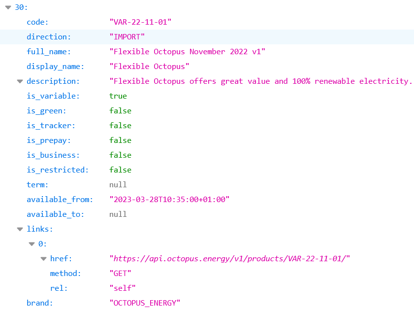
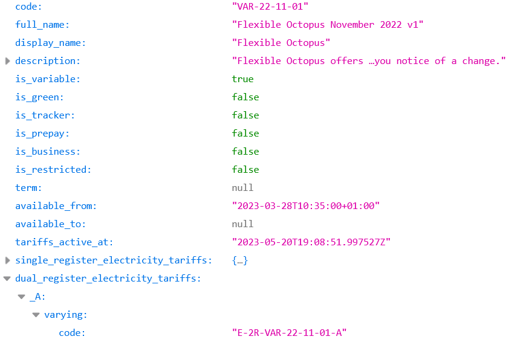

# Tariff Comparison

There will probably be times when you'll want to know if you're on the right tariff for you financially.

The tariff comparison allows you to elect a new tariff which will generate some additional sensors which will show the cost of your elected meter against that tariff.

After you've configured your [account](./account.md), you'll be able to configure tariff comparison sensors. These are configured by adding subsequent instances of the integration going through the [normal flow](https://my.home-assistant.io/redirect/config_flow_start/?domain=octopus_energy), and selecting `Tariff Comparison` in the provided menu.

!!! note

    This will only look and provide data inline with previous consumption data. There are no plans to provide data for any other time frame (e.g. "today"). This is for two reasons.

    1. I personally don't see the point of tracking this information against the current consumption as the value of the data will be larger in scope to just today (e.g. you're probably not going to switch tariffs because this morning is cheaper on another tariff) and while a tariff might be cheaper at one point during the day, it might be more expensive at another point. The value, to me, is in the historic trend of the data and knowing this a few hours early isn't going to save much.
    
    2. I only want the integration to retrieve data that is required for functionality to stay in the good books with OE

!!! info
    
    When updating the tariff depending on what previous consumption data is available, it can take up to 24 hours to update the cost. This will be improved in the future.

## Setup

### Meter

This is the meter whose consumption will be used as the basis for the calculation.

### Product Code

To find the product code, you can use the Octopus Energy API to search for current [home](https://api.octopus.energy/v1/products/) or [business](https://api.octopus.energy/v1/products/?is_business=true) products. Once your target product has been found, you will want to set this value to the value of the `code` property in the list of products.

For example if I wanted to check `Flexible Octopus November 2022 v1`. I would look up all of the [products](https://api.octopus.energy/v1/products) and look for my target under `full_name` or `display_name`.

I would then set my product code to `VAR-22-11-01`.

### Tariff Code

To find the tariff code, you can use the Octopus Energy API to search for the available tariffs for your target product.

For example if I wanted to check `Flexible Octopus November 2022 v1`. I would look up all of the [products](https://api.octopus.energy/v1/products) and look for my target under `full_name` or `display_name`. I would then look up the product by taking the value specified in the `code` field and putting it at the end of the [products url](https://api.octopus.energy/v1/products). Alternatively, you can follow the link that is present in the product listing.

In this scenario, the `code` is `VAR-22-11-01` and so the product url is [https://api.octopus.energy/v1/products/VAR-22-11-01](https://api.octopus.energy/v1/products/VAR-22-11-01). From this list, I would then look up the tariff for my region (e.g. `A` defined at the end of my current tariff) which is defined in the `code` field. Once your target tariff has been found, you will want to set this property in the configuration to the value of the `code` property. In this example, I want the duel electricity tariff version, so will pick `E-2R-VAR-22-11-01-A`.

## Entities

The following entities will be available for each entry

### Cost Override

`sensor.octopus_energy_electricity_{{METER_SERIAL_NUMBER}}_{{MPAN_NUMBER}}_previous_accumulative_cost_{{TARIFF COMPARISON NAME}}` for electricity based meters; `sensor.octopus_energy_gas_{{METER_SERIAL_NUMBER}}_{{MPRN_NUMBER}}_previous_accumulative_cost_{{TARIFF COMPARISON NAME}}` for gas based meters.

This will display the cost of your previous accumulative consumption against the elected tariff.

!!! info

    These sensors will compare the same time period as the [electricity previous accumulative consumption](../entities/electricity.md#previous-accumulative-consumption) or [gas previous accumulative consumption](../entities/gas.md#previous-accumulative-consumption-m3).

### Previous Consumption Override Day Rates

`event.octopus_energy_electricity_{{METER_SERIAL_NUMBER}}_{{MPAN_NUMBER}}_previous_consumption_rates_{{TARIFF COMPARISON NAME}}` for electricity based meters; `event.octopus_energy_gas_{{METER_SERIAL_NUMBER}}_{{MPRN_NUMBER}}_previous_consumption_rates_{{TARIFF COMPARISON NAME}}` for gas based meters.

The state of this sensor states when the previous consumption tariff comparison rates were last updated. The attributes of this sensor exposes the previous consumption tariff comparison rates. 

!!! note
    This is [disabled by default](../faq.md#there-are-entities-that-are-disabled-why-are-they-disabled-and-how-do-i-enable-them).

!!! info

    These sensors will provide rates for the same time period as the [electricity previous accumulative consumption](../entities/electricity.md#previous-accumulative-consumption) or [gas previous accumulative consumption](../entities/gas.md#previous-accumulative-consumption-m3).

| Attribute | Type | Description |
|-----------|------|-------------|
| `rates` | `array` | The list of rates applicable for the previous consumption tariff comparison |
| `product_code` | `string` | The product code associated with previous consumption tariff comparison rates |
| `tariff_code` | `string` | The tariff code associated with previous consumption tariff comparison rates |

Each rate item has the following attributes

| Attribute | Type | Description |
|-----------|------|-------------|
| `start` | `datetime` | The date/time when the rate starts |
| `end` | `datetime` | The date/time when the rate ends |
| `value_inc_vat` | `float` | The value of the rate including VAT. This is in pounds and pence (e.g. 1.01 = £1.01) |
| `is_capped` | `boolean` | Indicates if the rate has been capped by a [configured price cap](../setup/account.md#pricing-caps) |
| `is_intelligent_adjusted` | `boolean` | Indicates if the rate has been adjusted due to a dispatch organised by an intelligent tariff |