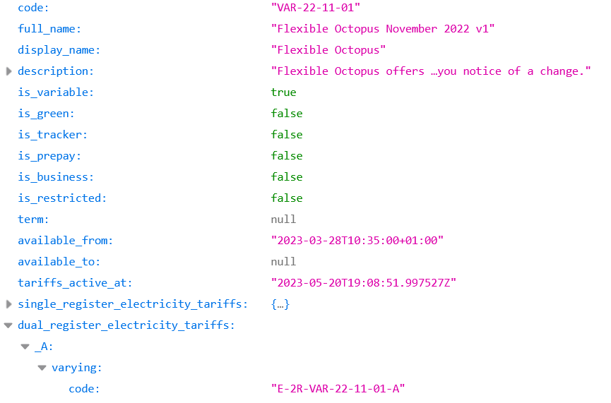

# Setup Account

- [Setup Account](#setup-account)
  - [Electricity Sensors](#electricity-sensors)
    - [Current Rate](#current-rate)
    - [Previous Rate](#previous-rate)
    - [Next rate](#next-rate)
    - [Smart Meter Sensors](#smart-meter-sensors)
      - [Previous Accumulative Consumption](#previous-accumulative-consumption)
      - [Previous Accumulative Consumptions (Peak Rate)](#previous-accumulative-consumptions-peak-rate)
      - [Previous Accumulative Consumption (Off Peak Rate)](#previous-accumulative-consumption-off-peak-rate)
      - [Previous Accumulative Cost](#previous-accumulative-cost)
      - [Previous Accumulative Cost (Peak Rate)](#previous-accumulative-cost-peak-rate)
      - [Previous Accumulative Cost (Off Peak Rate)](#previous-accumulative-cost-off-peak-rate)
    - [Export Sensors](#export-sensors)
  - [Gas Sensors](#gas-sensors)
    - [Current Rate](#current-rate-1)
    - [Smart Meter Sensors](#smart-meter-sensors-1)
      - [Previous Accumulative Consumption](#previous-accumulative-consumption-1)
      - [Previous Accumulative Consumption (kWH)](#previous-accumulative-consumption-kwh)
      - [Previous Accumulative Cost](#previous-accumulative-cost-1)
  - [Saving Sessions](#saving-sessions)
    - [Saving Session Points](#saving-session-points)
    - [Saving Sessions](#saving-sessions-1)
  - [Home Mini](#home-mini)
    - [Current Consumption (Electricity)](#current-consumption-electricity)
    - [Current Demand (Electricity)](#current-demand-electricity)
    - [Current Consumption (Gas)](#current-consumption-gas)
  - [Calorific Value](#calorific-value)
  - [Government Pricing Caps](#government-pricing-caps)
  - [Tariff Overrides](#tariff-overrides)
    - [Previous Accumulative Cost Override Tariff (Electricity)](#previous-accumulative-cost-override-tariff-electricity)
    - [Previous Accumulative Cost Override (Electricity)](#previous-accumulative-cost-override-electricity)
    - [Previous Accumulative Cost Override Tariff (Gas)](#previous-accumulative-cost-override-tariff-gas)
    - [Previous Accumulative Cost Override (Gas)](#previous-accumulative-cost-override-gas)
    - [How To Find A Tariff](#how-to-find-a-tariff)

Setup is done entirely via the [integration UI](https://my.home-assistant.io/redirect/config_flow_start/?domain=octopus_energy).

When you setup your account, you will get a few sensors.

## Electricity Sensors

You'll get the following sensors for each electricity meter with an active agreement.

### Current Rate

`sensor.octopus_energy_electricity_{{METER_SERIAL_NUMBER}}_{{MPAN_NUMBER}}_current_rate`

The rate of the current 30 minute period that energy consumption is charged at (including VAT).

### Previous Rate

`sensor.octopus_energy_electricity_{{METER_SERIAL_NUMBER}}_{{MPAN_NUMBER}}_previous_rate`

The rate of the previous 30 minute period that energy consumption was charged at (including VAT).

### Next rate

`sensor.octopus_energy_electricity_{{METER_SERIAL_NUMBER}}_{{MPAN_NUMBER}}_next_rate`

The rate of the next 30 minute period that energy consumption will be charged at (including VAT).

### Smart Meter Sensors

If your account information doesn't determine you have a smart meter, then you will have the following sensors in a disabled state. If you enable these sensors, they might not work correctly in this scenario.

If you are wishing to use these sensors with the Energy Dashboard, then you can follow this [guide](./energy_dashboard.md).

#### Previous Accumulative Consumption

`sensor.octopus_energy_electricity_{{METER_SERIAL_NUMBER}}_{{MPAN_NUMBER}}_previous_accumulative_consumption`

The total consumption reported by the meter for the previous day.

#### Previous Accumulative Consumptions (Peak Rate) 

`sensor.octopus_energy_electricity_{{METER_SERIAL_NUMBER}}_{{MPAN_NUMBER}}_previous_accumulative_consumption_peak`

The total consumption reported by the meter for the previous day that applied during peak hours. This is disabled by default. This will only be populated if you're on a tariff with two available rates.

#### Previous Accumulative Consumption (Off Peak Rate) 

`sensor.octopus_energy_electricity_{{METER_SERIAL_NUMBER}}_{{MPAN_NUMBER}}_previous_accumulative_consumption_off_peak`

The total consumption reported by the meter for the previous day that applied during off peak hours. This is disabled by default. This will only be populated if you're on a tariff with two available rates.

#### Previous Accumulative Cost

`sensor.octopus_energy_electricity_{{METER_SERIAL_NUMBER}}_{{MPAN_NUMBER}}_previous_accumulative_cost`

The total cost for the previous day, including the standing charge.

#### Previous Accumulative Cost (Peak Rate) 

`sensor.octopus_energy_electricity_{{METER_SERIAL_NUMBER}}_{{MPAN_NUMBER}}_previous_accumulative_cost_peak`

The total cost for the previous day that applied during peak hours. This is disabled by default. This will only be populated if you're on a tariff with two available rates.

#### Previous Accumulative Cost (Off Peak Rate) 

`sensor.octopus_energy_electricity_{{METER_SERIAL_NUMBER}}_{{MPAN_NUMBER}}_previous_accumulative_cost_off_peak`

The total cost for the previous day that applied during off peak hours. This is disabled by default. This will only be populated if you're on a tariff with two available rates.

### Export Sensors

If you export energy, then in addition you'll gain the above sensors with the name `export` present. E.g. `sensor.octopus_energy_electricity_{{METER_SERIAL_NUMBER}}_{{MPAN_NUMBER}}_export_current_rate`.

## Gas Sensors

You'll get the following sensors for each gas meter with an active agreement:

### Current Rate

`sensor.octopus_energy_gas_{{METER_SERIAL_NUMBER}}_{{MPRN_NUMBER}}_current_rate`

The rate of the current day that gas consumption is charged at (including VAT).

### Smart Meter Sensors

If your account information doesn't determine you have a smart meter, then you will have the following sensors in a disabled state. If you enable these sensors, they might not work correctly in this scenario. 

If you are wishing to use these sensors with the Energy Dashboard, then you can follow this [guide](./energy_dashboard.md).

#### Previous Accumulative Consumption

`sensor.octopus_energy_gas_{{METER_SERIAL_NUMBER}}_{{MPRN_NUMBER}}_previous_accumulative_consumption`

The total consumption reported by the meter for the previous day in m3. If your meter reports in m3, then this will be an accurate value reported by Octopus, otherwise it will be a calculated/estimated value.

#### Previous Accumulative Consumption (kWH)

`sensor.octopus_energy_gas_{{METER_SERIAL_NUMBER}}_{{MPRN_NUMBER}}_previous_accumulative_consumption_kwh`

The total consumption reported by the meter for the previous day in kwh. If your meter reports in kwh, then this will be an accurate value reported by Octopus, otherwise it will be a calculated/estimated value.

#### Previous Accumulative Cost

`sensor.octopus_energy_gas_{{METER_SERIAL_NUMBER}}_{{MPRN_NUMBER}}_previous_accumulative_cost`

The total cost for the previous day, including the standing charge.

> By default, it's not possible to include current consumption sensors. This is due to Octopus Energy only receive data from the smart meters up to the previous day.

## Saving Sessions

To support Octopus Energy's [saving sessions](https://octopus.energy/saving-sessions/), the following entities are available

### Saving Session Points

`sensor.octopus_energy_saving_session_points`

Supplies the points earned through the saving sessions

### Saving Sessions

`binary_sensor.octopus_energy_saving_sessions`

Binary sensor to indicate if a saving session that the account has joined is active. Also supplies the list of joined events including future events.

## Home Mini

If you are lucky enough to own an [Octopus Home Mini](https://octopus.energy/blog/octopus-home-mini/), you can now receive this data within Home Assistant. When setting up (or editing) your account within Home Assistant, you will need to check the box next to `I have a Home Mini`. This will gain the following sensors which can be added to the [energy dashboard](https://www.home-assistant.io/blog/2021/08/04/home-energy-management/):

> Please note, you will only have the same data exposed in the integration that is available within the app. There has been reports of gas not appearing within the app (and integration) straight away, so you might have to wait a few days for this to appear. Once it's available within the app, if you reload the integration (or restart Home Assistant) then the sensors should become available.

### Current Consumption (Electricity)

`sensor.octopus_energy_electricity_{{METER_SERIAL_NUMBER}}_{{MPAN_NUMBER}}_current_consumption`

The latest electricity consumption sent to Octopus Energy. This will update every minute. This has been built to see the accumulation within the energy dashboard. If you are wanting a sensor to see the current day's accumulation, then you will need to use something like [utility meter](https://www.home-assistant.io/integrations/utility_meter/). It has been noticed that daily consumption reported in Home Assistant can differ to when looking at past data within Octopus Energy. It looks like this is because Octopus Energy will favour "official" data from your smart meter over the data they collect.

If current consumption data is unable to be retrieved, then the integration will attempt to retrieve missing data. This will be done up to 5 days behind to give a buffer before the API requires a higher interval and will not be changed.

### Current Demand (Electricity)

`sensor.octopus_energy_electricity_{{METER_SERIAL_NUMBER}}_{{MPAN_NUMBER}}_current_demand`

The current demand reported by the Home Mini. This will try and update every minute.

### Current Consumption (Gas)

`sensor.octopus_energy_gas_{{METER_SERIAL_NUMBER}}_{{MPRN_NUMBER}}_current_consumption`

The latest gas consumption sent to Octopus Energy. By default, this will update every minute. This has been built to see the accumulation within the energy dashboard. If you are wanting a sensor to see the current day's accumulation, then you will need to use something like [utility meter](https://www.home-assistant.io/integrations/utility_meter/). It has been noticed that daily consumption reported in Home Assistant can differ to when looking at past data within Octopus Energy. It looks like this is because Octopus Energy will favour "official" data from your smart meter over the data they collect.

If current consumption data is unable to be retrieved, then the integration will attempt to retrieve missing data. This will be done up to 5 days behind to give a buffer before the API requires a higher interval and will not be changed.

## Calorific Value

When calculating gas costs, a calorific value is included in the calculation. Unfortunately this changes from region to region and is not provided by the Octopus Energy API. The default value of this is `40`, but if you check your latest bill you should be able to find the value for you. This will give you a more accurate consumption and cost calculation when your meter reports in `m3`.

## Government Pricing Caps

There has been inconsistencies across tariffs on whether government pricing caps are included or not. Therefore the ability to configure pricing caps has been added within you account. Please note that while rates are reflected straight away, consumption based sensors may take up to 24 hours to reflect. This is due to how they look at data and cannot be changed.

## Tariff Overrides

You may be on an existing tariff but want to know if the grass is greener (or cheaper) on the other side. The following entities are available in a disabled state, which when enabled can give you an indication what you'd be paying if you were on a different tariff and didn't change your energy habits.

> Please note: When updating the tariff depending on what previous consumption data is available, it can take up to 24 hours to update the cost. This will be improved in the future.

There are plans to be able to override tariffs at a global level so that you can test target rate sensors and potential automations you may have running against the main sensors. However, this hasn't been implemented yet.

### Previous Accumulative Cost Override Tariff (Electricity)

`text.octopus_energy_electricity_{{METER_SERIAL_NUMBER}}_{{MPAN_NUMBER}}_previous_accumulative_cost_override_tariff`

This is used to define the electricity tariff you want to compare
### Previous Accumulative Cost Override (Electricity)

`sensor.octopus_energy_electricity_{{METER_SERIAL_NUMBER}}_{{MPAN_NUMBER}}_previous_accumulative_cost_override`

This is the cost of the previous electricity accumulation based on the specified tariff override.

### Previous Accumulative Cost Override Tariff (Gas)

`text.octopus_energy_gas_{{METER_SERIAL_NUMBER}}_{{MPRN_NUMBER}}_previous_accumulative_cost_override_tariff`

This is used to define the gas tariff you want to compare

### Previous Accumulative Cost Override (Gas)

`sensor.octopus_energy_gas_{{METER_SERIAL_NUMBER}}_{{MPRN_NUMBER}}_previous_accumulative_cost_override`

This is the cost of the previous gas accumulation based on the specified tariff override.

### How To Find A Tariff

To find an available tariff, you can use the Octopus Energy API to search for [current products](https://developer.octopus.energy/docs/api/#list-products). Once a product has been found, you can look up the product to find the tariff in your region and for your target energy supply.

For example if I was on the tariff `E-1R-SUPER-GREEN-24M-21-07-30-A` and I wanted to check `Flexible Octopus November 2022 v1`. I would look up all of the [products](https://api.octopus.energy/v1/products) and look for my target under `full_name` or `display_name`. I would then look up the product by taking the specified `code` and putting it at the end of the [products url](https://api.octopus.energy/v1/products). 

In this scenario, the `code` is `VAR-22-11-01` and so the product url is [https://api.octopus.energy/v1/products/VAR-22-11-01](https://api.octopus.energy/v1/products/VAR-22-11-01). From this list, I would then look up the tariff for my region (e.g. `A` defined at the end of my current tariff) which is defined in the `code` field. It is this value that you add to the `cost_override_tariff` sensors. In this example, I want the duel electricity tariff version, so will pick `E-2R-VAR-22-11-01-A`.

